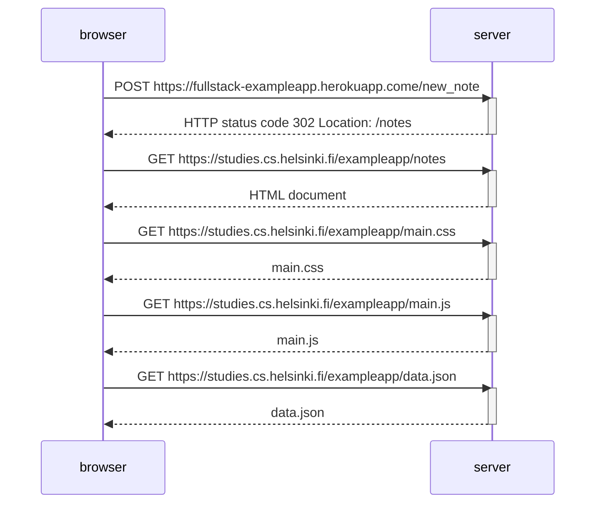

Exercise 0.4 - user creates a new note

```mermaid
sequenceDiagram
  participant browser
  participant server
  
  browser->>server: POST https://fullstack-exampleapp.herokuapp.come/new_note
  activate server
  server-->>browser: HTTP status code 302 Location: /notes
  deactivate server
  
  browser->>server: GET https://studies.cs.helsinki.fi/exampleapp/notes
  activate server
  server-->>browser: HTML document
  deactivate server
  
  browser->>server: GET https://studies.cs.helsinki.fi/exampleapp/main.css
  activate server
  server-->>browser: main.css
  deactivate server
  
  browser->>server: GET  https://studies.cs.helsinki.fi/exampleapp/main.js
  activate server
  server-->>browser: main.js
  deactivate server
  
  browser->>server: GET  https://studies.cs.helsinki.fi/exampleapp/data.json
  activate server
  server-->>browser: data.json
  deactivate server 
```
