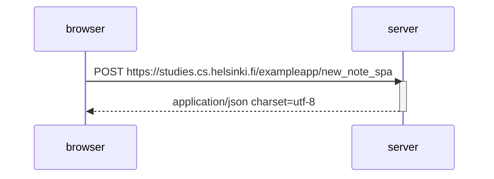

Exercise 0.6 - user submits on singlep page app

```mermaid
sequenceDiagram
  participant browser
  participant server
  
  browser->>server: POST  https://studies.cs.helsinki.fi/exampleapp/new_note_spa
  activate server
  server-->>browser: application/json charset=utf-8
  deactivate server
```
